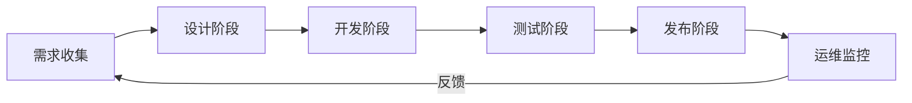

# 产品开发流程

本文档定义 MIPYAO 公司从设计到发布的产品开发全流程，确保团队协作高效、交付质量可控。

## 流程概览



## 阶段一：设计阶段

### 目标
将产品需求转化为可执行的设计方案和技术规格。

### 工作流程

1. **需求确认**
   - 产品负责人整理需求文档（PRD）
   - 明确功能范围、用户故事、验收标准
   - 在 Paperclip 中创建主任务，关联子任务

2. **技术方案设计**
   - CTO/技术负责人评估技术可行性
   - 编写技术方案文档（含架构图、数据模型）
   - 创建 ADR（架构决策记录）记录关键决策

3. **UI/UX 设计**
   - 设计师输出线框图和视觉稿
   - 设计评审会议确认设计方案
   - 设计稿上传至设计系统（Pencil/Pen）

4. **任务拆分**
   - 将设计交付物拆分为可开发的子任务
   - 在 Paperclip 中创建任务层级结构
   - 估算工作量，分配优先级

### 交付物
- [ ] 产品需求文档（PRD）
- [ ] 技术方案文档
- [ ] UI/UX 设计稿
- [ ] Paperclip 任务结构

### 完成标准
- PRD 已通过评审
- 技术方案获得团队认可
- 设计稿已定稿
- 所有子任务已在 Paperclip 中创建并分配

## 阶段二：开发阶段

### 目标
按照设计方案实现功能，保证代码质量和进度。

### 工作流程

1. **分支创建**
   ```bash
   # 从 develop 分支创建功能分支
   git checkout develop
   git pull origin develop
   git checkout -b feature/功能名称
   ```

2. **开发实现**
   - 遵循代码规范（ESLint + Prettier）
   - 采用测试驱动开发（TDD）或先开发后补测试
   - 定期提交，提交信息遵循 Conventional Commits 规范

3. **本地验证**
   ```bash
   # 运行代码检查
   npm run lint
   npm run format

   # 运行测试
   npm test

   # 本地构建验证
   npm run build
   ```

4. **代码审查准备**
   - 自审代码，确保逻辑清晰
   - 更新相关文档
   - 推送代码到远程分支

### 开发规范

| 项目 | 要求 |
|------|------|
| 代码风格 | ESLint + Prettier |
| 提交规范 | Conventional Commits |
| 测试覆盖 | 新功能必须有单元测试 |
| 文档更新 | API 变更需同步更新文档 |

### 完成标准
- 功能实现符合 PRD 要求
- 所有测试通过（单元测试 + 集成测试）
- 代码检查无错误和警告
- 本地构建成功

## 阶段三：测试阶段

### 目标
通过系统性测试确保产品质量，发现并修复缺陷。

### 测试类型

1. **单元测试**
   - 覆盖范围：工具函数、组件逻辑、服务层
   - 运行环境：本地 + CI 流水线
   - 工具：Node.js assert / Jest

2. **集成测试**
   - 验证模块间交互
   - 数据库连接测试
   - API 端点测试

3. **端到端测试（E2E）**
   - 模拟用户真实操作流程
   - 覆盖核心业务流程
   - 工具：待选型（Playwright/Cypress）

4. **手动测试**
   - 探索性测试
   - UI/UX 体验验证
   - 跨浏览器兼容性检查

### CI/CD 流水线

```yaml
# .github/workflows/ci.yml（已配置）
测试阶段包含：
  - 代码检查（ESLint）
  - 单元测试
  - 构建验证
  - 安全扫描（Dependabot）
```

### 缺陷管理

1. 发现缺陷 → 在 Paperclip 创建 Bug 任务
2. 评估优先级 → P0（阻断）/ P1（高）/ P2（中）/ P3（低）
3. 分配修复 → 指定负责人和截止日期
4. 验证修复 → QA 回归测试

### 完成标准
- 所有 P0/P1 缺陷已修复
- 测试覆盖率达到预定目标（建议 >80%）
- CI/CD 流水线全部通过
- QA 签署测试完成报告

## 阶段四：发布阶段

### 目标
将经过测试的代码安全、可控地发布到生产环境。

### 发布准备

1. **发布分支创建**
   ```bash
   git checkout develop
   git pull origin develop
   git checkout -b release/v版本号
   ```

2. **发布前检查**（见下方检查清单）

3. **版本号管理**
   - 遵循语义化版本规范（Semantic Versioning）
   - 格式：主版本.次版本.修订号（如 v1.2.3）

### 发布流程

```bash
# 1. 合并到 main 分支
git checkout main
git merge release/v1.2.3
git tag v1.2.3
git push origin main --tags

# 2. 同步回 develop 分支
git checkout develop
git merge release/v1.2.3
git push origin develop

# 3. 删除发布分支
git branch -d release/v1.2.3
git push origin --delete release/v1.2.3

# 4. GitHub Release 创建（可选）
gh release create v1.2.3 --notes "发布说明"
```

### 发布后验证

1. 生产环境健康检查
2. 核心功能冒烟测试
3. 监控指标观察（错误率、响应时间）
4. 用户反馈收集

### 回滚方案

若发布后出现严重问题：
```bash
# 快速回滚到上一个稳定版本
git checkout main
git revert <有问题的提交哈希>
git push origin main
```

## 代码审查流程

### 审查时机
- 所有代码合并到 `develop` 或 `main` 前必须经过审查
- 功能分支通过 CI 检查后创建 PR（Pull Request）

### 审查步骤

1. **开发者创建 PR**
   - 填写 PR 模板（描述、关联 Issue、测试说明）
   - 指定审查者（至少 1 人）
   - 确保 CI 全部通过

2. **审查者检查**（参考审查清单）
   - 功能正确性
   - 代码质量和可维护性
   - 测试覆盖
   - 安全考虑
   - 性能影响

3. **反馈与修改**
   - 审查者提出意见（行内评论）
   - 开发者响应并修改代码
   - 更新 PR 直至满足合并条件

4. **合并方式**
   - 优先使用 **Squash Merge**（保持提交历史整洁）
   - 特殊情况可使用 Merge Commit

### 审查清单

- [ ] 代码功能符合需求
- [ ] 代码逻辑清晰，易于理解
- [ ] 已添加适当的错误处理
- [ ] 已添加单元测试（如适用）
- [ ] 代码符合 ESLint 和 Prettier 规范
- [ ] 没有硬编码的敏感信息（密码、密钥等）
- [ ] 提交信息符合 Conventional Commits 规范
- [ ] 没有引入明显的安全漏洞
- [ ] 性能考虑（避免 N+1 查询、大循环等）
- [ ] 文档已同步更新（API、README 等）

## 发布检查清单

### 发布前（Pre-release）

- [ ] 所有功能开发完成并通过测试
- [ ] 所有 P0/P1 缺陷已修复
- [ ] CI/CD 流水线全部通过
- [ ] 代码审查已完成并合并
- [ ] 版本号已更新（package.json 等）
- [ ] CHANGELOG 已更新（记录重大变更）
- [ ] 数据库迁移脚本已准备并测试
- [ ] 环境变量和配置已检查
- [ ] 依赖包无已知安全漏洞（npm audit）
- [ ] 文档已更新（README、API 文档等）

### 发布中（During Release）

- [ ] 发布分支已创建（release/vX.X.X）
- [ ] 发布前最后检查已完成
- [ ] 代码已合并到 main 分支
- [ ] Git 标签已打上（vX.X.X）
- [ ] 代码已同步回 develop 分支
- [ ] GitHub Release 已创建（含发布说明）

### 发布后（Post-release）

- [ ] 生产环境健康检查通过
- [ ] 核心功能冒烟测试通过
- [ ] 监控指标正常（错误率、响应时间）
- [ ] 用户反馈渠道畅通
- [ ] 发布通知已发送给相关团队
- [ ] 发布分支已清理

## 与 Paperclip 任务系统集成

### 集成目标
将产品开发流程中的每个阶段映射到 Paperclip 任务系统，实现进度可视化和自动化管理。

### 任务结构映射

```
MIP-X: 产品功能主任务（Paperclip Issue）
├── MIP-X.1: 设计阶段
│   ├── MIP-X.1.1: 编写 PRD
│   ├── MIP-X.1.2: 技术方案设计
│   └── MIP-X.1.3: UI/UX 设计
├── MIP-X.2: 开发阶段
│   ├── MIP-X.2.1: 功能 A 开发
│   ├── MIP-X.2.2: 功能 B 开发
│   └── MIP-X.2.3: 单元测试编写
├── MIP-X.3: 测试阶段
│   ├── MIP-X.3.1: 集成测试
│   ├── MIP-X.3.2: E2E 测试
│   └── MIP-X.3.3: Bug 修复
└── MIP-X.4: 发布阶段
    ├── MIP-X.4.1: 发布准备
    ├── MIP-X.4.2: 生产发布
    └── MIP-X.4.3: 发布验证
```

### 任务状态流转

| Paperclip 状态 | 对应阶段 | 说明 |
|----------------|----------|------|
| `todo` | 待开始 | 任务已创建，等待分配 |
| `in_progress` | 进行中 | 当前正在处理 |
| `blocked` | 已阻塞 | 等待依赖或外部输入 |
| `in_review` | 审查中 | 代码审查或测试验证 |
| `done` | 已完成 | 工作完成并验收通过 |

### 自动化集成

1. **分支与任务关联**
   - 分支命名包含任务 ID：`feature/MIP-X.2.1-description`
   - 提交信息包含任务引用：`feat(MIP-X.2.1): 添加用户登录功能`

2. **PR 与任务关联**
   - PR 描述中引用任务 ID：`Closes MIP-X.2.1`
   - 合并 PR 后自动更新任务状态

3. **状态同步**
   - 通过 Paperclip API 更新任务状态
   - 关键节点自动创建评论通知

### API 调用示例

```bash
# 创建主任务
curl -X POST https://paperclip.api/issues \
  -H "Content-Type: application/json" \
  -d '{
    "title": "MIP-X: 产品功能开发",
    "description": "产品功能开发主任务",
    "priority": "high"
  }'

# 创建子任务
curl -X POST https://paperclip.api/issues \
  -H "Content-Type: application/json" \
  -d '{
    "title": "MIP-X.1: 设计阶段",
    "parentId": "MIP-X",
    "description": "设计阶段交付物"
  }'

# 更新任务状态
curl -X PATCH https://paperclip.api/issues/MIP-X.1 \
  -H "Content-Type: application/json" \
  -d '{"status": "in_progress"}'
```

### 任务模板

创建新功能任务时，使用以下模板：

```markdown
# 任务标题：MIP-X: [功能名称]

## 描述
[功能简要描述]

## 阶段
- [ ] 设计阶段
- [ ] 开发阶段
- [ ] 测试阶段
- [ ] 发布阶段

## 交付物
- [ ] PRD 文档
- [ ] 技术方案
- [ ] 设计稿
- [ ] 代码实现
- [ ] 测试用例
- [ ] 发布文档

## 验收标准
1. [标准 1]
2. [标准 2]
3. [标准 3]

## 依赖
- [依赖任务 ID]

## 负责人
- 开发：
- 设计：
- 测试：
```

## 角色与职责

| 角色 | 职责 |
|------|------|
| 产品负责人（CEO） | 需求定义、优先级排序、验收标准 |
| CTO/技术负责人 | 技术决策、架构设计、代码审查 |
| 开发工程师 | 功能实现、单元测试、文档编写 |
| UX 设计师 | UI/UX 设计、设计系统维护 |
| QA 工程师 | 测试计划、测试执行、质量把关 |

## 流程改进

### 回顾会议
每个版本发布后，团队进行回顾会议：
- 讨论本次发布中的亮点和问题
- 收集流程改进建议
- 更新本文档（如有必要）

### 度量指标
跟踪以下指标以持续改进：
- 从需求到发布的平均周期时间
- 每个阶段的耗时占比
- Bug 数量和严重程度分布
- 发布后回滚/热修复次数

## 更新记录

| 日期 | 版本 | 变更内容 | 作者 |
|------|------|----------|------|
| 2026-05-09 | v1.0 | 初始版本，定义完整产品开发流程 | CTO |

## 参考文档

- [Git 分支策略](./branching-strategy.md)
- [贡献指南](../CONTRIBUTING.md)
- [技术栈总结](../TECH_STACK_SUMMARY.md)
- [架构决策记录](../adr/README.md)
